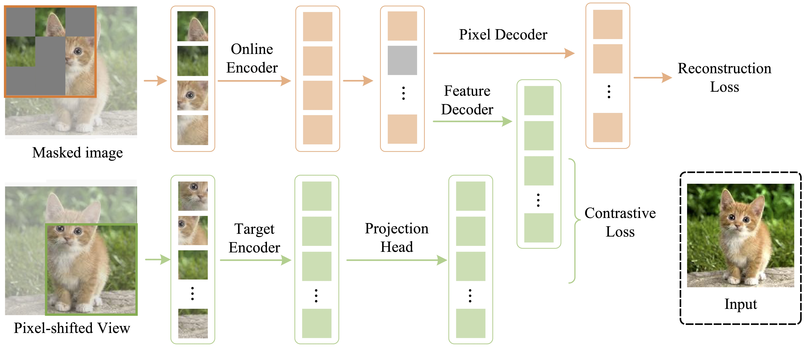

## Contrastive Masked Autoencoders are Stronger Vision Learners



The official implementation of the paper  [Contrastive Masked Autoencoders are Stronger Vision Learners](https://arxiv.org/abs/2207.13532)

```latex
@article{huang2023contrastive,
  title={Contrastive masked autoencoders are stronger vision learners},
  author={Huang, Zhicheng and Jin, Xiaojie and Lu, Chengze and Hou, Qibin and Cheng, Ming-Ming and Fu, Dongmei and Shen, Xiaohui and Feng, Jiashi},
  journal={IEEE Transactions on Pattern Analysis and Machine Intelligence},
  year={2023},
  publisher={IEEE}
}
```


## Installation

**Step 0.**  Download and install Miniconda from [official website](https://docs.conda.io/en/latest/miniconda.html)

**Step 1.**  Create a conda environment and activate it

```bash
conda create --name cmae python=3.9 -y
conda activate cmae
```

**Step 2.** Install PyTorch following official instructions, e.g.

```bash
conda install pytorch==2.1.0 torchvision==0.16.0 torchaudio==2.1.0 pytorch-cuda=12.1 -c pytorch -c nvidia
```

**Step 3.** Install MMCV

```bash
pip3 install boto3 addict tqdm regex pyyaml opencv-python opencv-contrib-python future tensorboard filelock yapf attrs einops opencv-python-headless numpy scipy  mmcv==2.1.0 psutil mmengine timm
```

**Step 4.** Install CMAE

```bash
git clone https://github.com/ZhichengHuang/CMAE
cd CMAE
pip3 install -v -e .
```

## Prepare ImageNet

1. Register an account and login to the [download page](https://image-net.org/challenges/LSVRC/2012/2012-downloads.php)

2. Find download links for ILSVRC2012 and download the following two files:

   - ILSVRC2012_img_train.tar
   - ILSVRC2012_img_val.tar
   - ILSVRC2012_devkit_t12.tar.gz

3. Untar the download files

   ```bash
   mkdir train && tar -xvf ILSVRC2012_img_train.tar -C train && for x in `ls train/*tar`; do fn=train/`basename $x .tar`; mkdir $fn; tar -xvf $x -C $fn; rm -f $fn.tar; done
   # if success, then retrun 11,281,167
   ls -lR|grep "^-"|wc -l
   
   # unzip validation
   mkdir val
   tar xvf ILSVRC2012_img_val.tar -C ./val
   
   tar -xzf ILSVRC2012_devkit_t12.tar.gz
   
   ```

4. The project has the following structures.

   ```
   CMAE
   ├── cmae
   ├── tools
   ├── configs
   ├── docs
   ├── work_dirs
   │   ├──init
   ├── data
   │   ├── ImageNet
   │   │   ├── ImageNet_train.json
   │   │   ├── ImageNet_val.json
   │   │   ├── train
   │   │   ├── val
   
   ```

## Fine-tuning with pre-trained checkpoints

The following table provides the pre-trained checkpoints

|   Size   | Model | Epoch |                              PT                              |                              FT                              | ImageNet Acc. |
| :------: | :---: | :---: | :----------------------------------------------------------: | :----------------------------------------------------------: | :-----------: |
| ViT-Base |  MAE  |  300  |                              -                               |                              -                               |     82.9      |
| ViT-Base |  MAE  | 1600  |                              -                               |                              -                               |     83.6      |
| ViT-Base | CMAE  |  300  | [aws](https://cmae.s3.us-west-1.amazonaws.com/weight/cmae_vit-base-p16_32xb128-coslr-300e_in1k.pth)\|[ali](https://cmae.oss-cn-beijing.aliyuncs.com/weight/cmae_vit-base-p16_32xb128-coslr-1600e_in1k.pth) | [aws](https://cmae.s3.us-west-1.amazonaws.com/weight/cmae_base_pre300_8x128_100e_in1k_amp_fine.pth)\|[ali](https://cmae.oss-cn-beijing.aliyuncs.com/weight/cmae_base_pre300_8x128_100e_in1k_amp_fine.pth) |     83.8      |
| ViT-Base | CMAE  | 1600  | [aws](https://cmae.s3.us-west-1.amazonaws.com/weight/cmae_vit-base-p16_32xb128-coslr-1600e_in1k.pth)\|[ali](https://cmae.oss-cn-beijing.aliyuncs.com/weight/cmae_vit-base-p16_32xb128-coslr-1600e_in1k.pth) | [aws](https://cmae.s3.us-west-1.amazonaws.com/weight/cmae_base_pre1600_8x128_100e_in1k_amp_fine.pth)\|[ali](https://cmae.oss-cn-beijing.aliyuncs.com/weight/cmae_base_pre1600_8x128_100e_in1k_amp_fine.pth) |     84.7      |

```bash
# download the pre-training weights to the "work_dirs/init/"
cd work_dirs/init/
wget https://cmae.s3.us-west-1.amazonaws.com/weight/cmae_vit-base-p16_32xb128-coslr-300e_in1k.pth
#run the fine-tuning script with 8 GPUs
bash tools/dist_train.sh configs/fine-tuning/cmae/cmae_base_pre300_8x128_100e_in1k_amp.py 8
# direct test without fine-tuning model
mkdir -p work_dirs/fine-tuning/cmae_base_pre300_8x128_100e_in1k_amp
cd work_dirs/fine-tuning/cmae_base_pre300_8x128_100e_in1k_amp
#download the fine-tuning weight
wget https://cmae.s3.us-west-1.amazonaws.com/weight/cmae_base_pre300_8x128_100e_in1k_amp_fine.pth
#test the model
bash tools/dist_test.sh configs/fine-tuning/cmae/cmae_base_pre300_8x128_100e_in1k_amp.py work_dirs/fine-tuning/cmae_base_pre300_8x128_100e_in1k_amp/cmae_base_pre300_8x128_100e_in1k_amp_fine.pth 8
```


## Pre-training

```bash
# pre-training the model with 4*8 GPUs,  
# node 0
bash tools/dist_train.sh configs/pre-training/cmae/cmae_vit-base-p16_32xb128-coslr-1600e_in1k.py 8 4 0 
# node 1
bash tools/dist_train.sh configs/pre-training/cmae/cmae_vit-base-p16_32xb128-coslr-1600e_in1k.py 8 4 1
# node 2
bash tools/dist_train.sh configs/pre-training/cmae/cmae_vit-base-p16_32xb128-coslr-1600e_in1k.py 8 4 2
# node 3
bash tools/dist_train.sh configs/pre-training/cmae/cmae_vit-base-p16_32xb128-coslr-1600e_in1k.py 8 4 3

# when you finish the pre-training you can use the script to extract the backbone weight for downstream tasks fine-tuning
python3 tools/extract_backbone_weights.py pre-training.pth init_weight.pth

```

more details for training model with multiple machines, you can refer to [mmengine](https://mmengine.readthedocs.io/en/latest/common_usage/distributed_training.html).

 

Our previous code was based on mmcv. Due to the upgrade of some external libraries, some areas were incompatible. Therefore, we redesigned all the code based on mmengine, and the pytorch version was also upgraded to torch2.1.

Thanks to [mmengine](https://github.com/open-mmlab/mmengine) and [mmselfsup](https://github.com/open-mmlab/mmselfsup), the code organization structure and part of the code in this project refer to these two open source projects.
